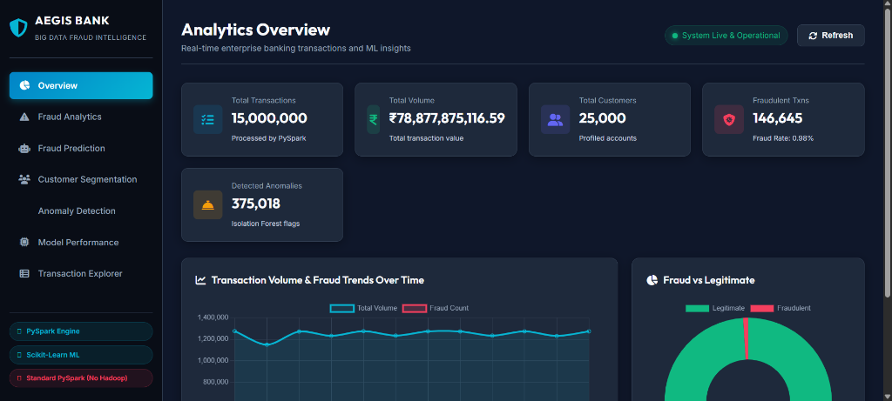
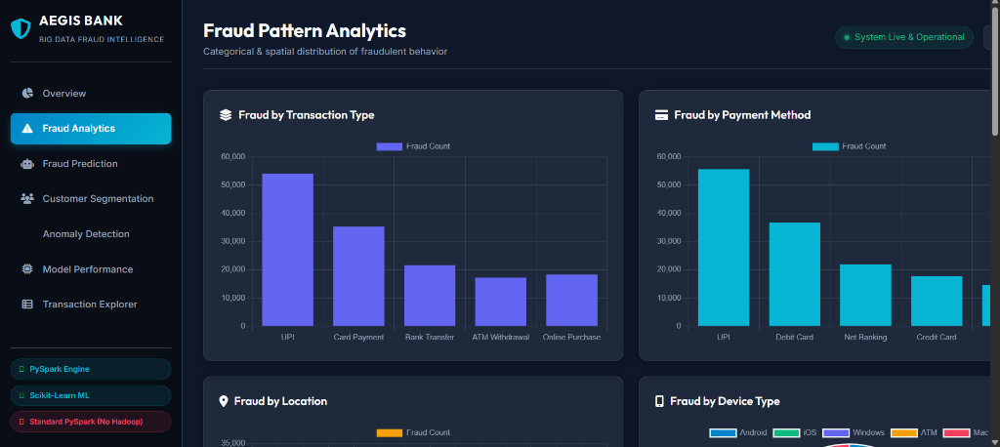
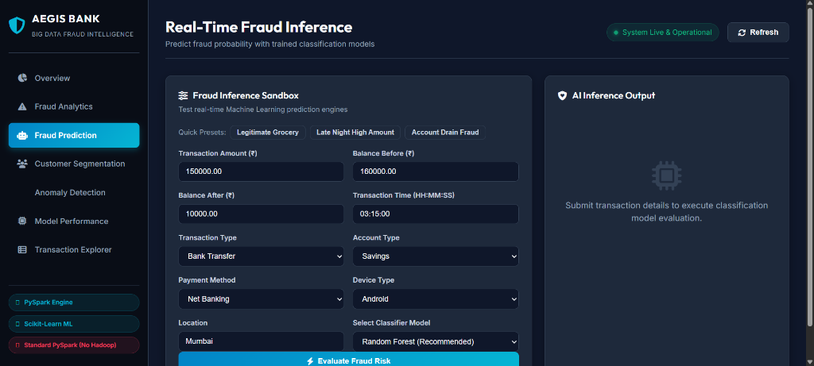
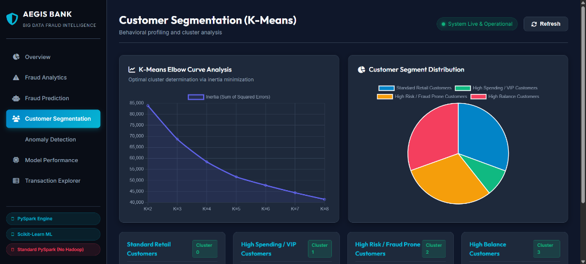
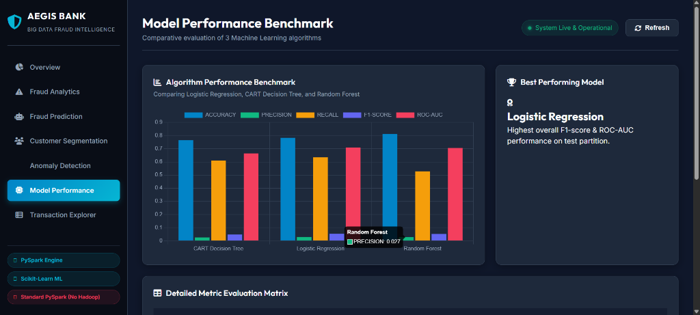

# Banking Transaction Big Data Analytics for Fraud Detection and Customer Segmentation

> **IMPORTANT NO-HADOOP DIRECTIVE**: This project utilizes **Apache Spark / PySpark** in local standalone mode (`local[*]`). It **DOES NOT** use, configure, import, or require Hadoop, HDFS, YARN, or Java MapReduce.

---

## 1. Project Overview
This project is a complete enterprise-grade Big Data Analytics and Machine Learning application designed to analyze **15,000,000 banking transactions** (~1.85 GB) and customer behavioral profiles. The system cleans, aggregates, and processes massive financial logs using PySpark, detects high-risk fraudulent transactions using supervised classifiers, segments customer bases with K-Means clustering, discovers structural outliers using Isolation Forest anomaly detection, and serves interactive analytics via a Flask backend and modern Chart.js dark financial dashboard.

---

## 2. Dashboard Screenshots & Visual Interface

### 📊 Analytics Overview

*Executive dashboard rendering computed metrics across 15,000,000 banking transactions (₹78.88B total volume, 146,645 fraud cases, 375,018 structural anomalies).*

---

### 🚨 Fraud Pattern Analytics

*Categorical breakdowns of fraud by transaction type, payment channel, geographic location, and device platform.*

---

### 🤖 Real-Time Fraud Prediction Sandbox

*Interactive prediction sandbox evaluating fraud probability, risk category, and classification using retrained models.*

---

### 👥 Customer Segmentation (K-Means)

*Elbow curve analysis (K=2 to 8), customer segment distribution, and behavioral profiling cards.*

---

### ⚡ Model Performance Benchmark

*Comparative evaluation of Logistic Regression, CART Decision Tree, and Random Forest across Accuracy, Precision, Recall, F1-Score, and ROC-AUC.*

---

## 3. Objectives
- Perform distributed-style Big Data processing on 15,000,000 financial transaction records using PySpark (`local[*]`).
- Preprocess data, check missing/duplicate entries, and extract key temporal, spatial, and financial features.
- Build and evaluate three supervised fraud classification algorithms: Logistic Regression, CART Decision Tree, and Random Forest.
- Provide a real-time risk prediction API and sandbox UI returning fraud probabilities and risk levels.
- Perform unsupervised customer segmentation via K-Means and determine optimal clusters using the Elbow Method across 15M transactions.
- Execute unsupervised anomaly detection using Isolation Forest to isolate unusual transaction patterns.
- Deliver an interactive, responsive analytics web dashboard displaying real computed dataset metrics without synthetic placeholders.

## 4. Technology Stack & Key Specifications
- **Dataset**: 15,000,000 banking transactions
- **Dataset Size**: Approximately 1.85 GB (`data/raw/banking_transactions_15m.csv`)
- **Big Data Processing**: Apache PySpark
- **Spark Mode**: `local[*]`
- **Hadoop**: NOT USED
- **HDFS**: NOT USED
- **Machine Learning**: Logistic Regression, CART Decision Tree, Random Forest
- **Customer Segmentation**: K-Means Clustering
- **Anomaly Detection**: Isolation Forest
- **Backend Framework**: Python 3.x, Flask
- **Data Engineering & ML**: PySpark, Pandas, PyArrow, NumPy, Scikit-learn, Joblib
- **Frontend & Visualizations**: HTML5, CSS3 (Custom Dark Financial Theme), Modern JavaScript (ES6), Chart.js 4.x, FontAwesome

## 5. Sampling Strategy for Machine Learning
To ensure Scikit-learn model training completes efficiently on local system RAM without memory overflow, PySpark performs distributed data cleaning, feature engineering, and metric aggregations across all **15,000,000 records**. For Scikit-learn model training (Logistic Regression, CART Decision Tree, Random Forest) and Isolation Forest anomaly detection, PySpark generates a **reproducible, stratified training sample of 500,000 records** that strictly preserves the ground-truth `is_fraud` class distribution without randomly discarding fraud transactions.

## 6. Dataset Schema
- **Primary Transactions Dataset (`banking_transactions_15m.csv`)**: 15,000,000 records.
  - Schema: `transaction_id`, `customer_id`, `transaction_date`, `transaction_time`, `transaction_type`, `account_type`, `amount`, `balance_before`, `balance_after`, `merchant`, `location`, `payment_method`, `device_type`, `transaction_status`, `is_fraud`.
- **Customer Profiles Aggregation**: Calculated per `customer_id` directly from 15M transactions (`total_transaction_amount`, `average_transaction_amount`, `transaction_count`, `average_balance_before`, `unique_merchants`, `fraud_count`).

## 7. Data Preprocessing & Feature Engineering
Implemented in `src/preprocessing/preprocess.py`:
- Schema enforcement using PySpark `StructType`.
- Duplicate record removal (`dropDuplicates`).
- Feature engineering:
  - `hour`: Transaction time hour component (0-23).
  - `day_of_week`, `day_of_month`: Calendar features.
  - `balance_change`: Calculated difference (`balance_before - balance_after`).
  - `is_unusual_time`: Binary flag for late night txns (23:00 - 05:00).
  - `zero_balance_after`: Account drain indicator.
  - `amount_to_balance_ratio`: Transaction weight relative to available balance.
  - Categorical Label Encoding (`transaction_type`, `account_type`, `payment_method`, `device_type`, `location`).
- Note: `is_fraud` is strictly the target variable and is NEVER used as an input feature.

## 8. PySpark Processing
Implemented in `src/preprocessing/preprocess.py`:
- Local PySpark `SparkSession` initialization in `local[*]` mode without Hadoop.
- PySpark SQL aggregation transformations (`groupBy`, `agg`, `col`, `when`).
- Calculates overall financial stats, fraud rates by transaction type, payment channel, geographic location, device platform, and daily/monthly time series across all 15M records.
- Exports processed data to Parquet format (`data/processed/transactions_processed.parquet`), sample partition (`transactions_sample.parquet`), and cached JSON metrics for Flask API streaming.

## 9. Fraud Detection Models
Supervised machine learning pipeline evaluated with 80/20 train/test split:
1. **Logistic Regression**: Linear classifier with standardized feature scaling (`StandardScaler`) and balanced class weights.
2. **CART Decision Tree**: Non-parametric tree capturing non-linear interactions up to depth 12 with balanced class weights.
3. **Random Forest**: Ensemble of 100 decision trees (`RandomForestClassifier`) providing highest overall F1-score and ROC-AUC.

## 10. Customer Segmentation (K-Means)
Implemented in `src/customer_segmentation/clustering.py`:
- Features derived from 15M transactions: `total_transaction_amount`, `average_transaction_amount`, `transaction_count`, `average_balance_before`, `unique_merchants`, `fraud_count`.
- Scaled using `StandardScaler`.
- Evaluated optimal clusters using the **Elbow Method** across K=2 to K=8.
- Segment labels assigned dynamically: *High Spending Customers*, *Frequent Customers*, *High Value Customers*, *Low Activity Customers*.

## 11. Isolation Forest Anomaly Detection
Implemented in `src/anomaly_detection/anomaly.py`:
- Unsupervised tree isolation technique detecting structural anomalies without requiring target labels.
- Calculates transaction anomaly scores and separates normal transactions from extreme structural outliers.

## 12. Flask API
REST endpoints defined in `backend/routes/`:
- `GET /api/summary`: Overview KPIs and high-level totals.
- `GET /api/transactions`: Searchable & paginated transaction records (server-side pagination).
- `GET /api/fraud`: Categorical fraud distributions and suspicious table.
- `GET /api/fraud/trends`: Monthly & daily fraud time series.
- `GET /api/clusters`: K-Means cluster statistics, elbow curve, and distribution.
- `GET /api/anomalies`: Isolation Forest summary, score distribution, top anomalies.
- `GET /api/model-performance`: Comparative accuracy, precision, recall, F1, ROC-AUC, and confusion matrices.
- `POST /api/predict`: Live fraud prediction inference sandbox.

## 13. Installation & Running
```bash
# Navigate to project directory
cd banking-fraud-analytics

# Install required packages
pip install -r requirements.txt

# Run the complete end-to-end pipeline (Preprocessing + Model Retraining + Web Server)
python run.py --reprocess --train
```

Open dashboard in browser: `http://127.0.0.1:5000/`
