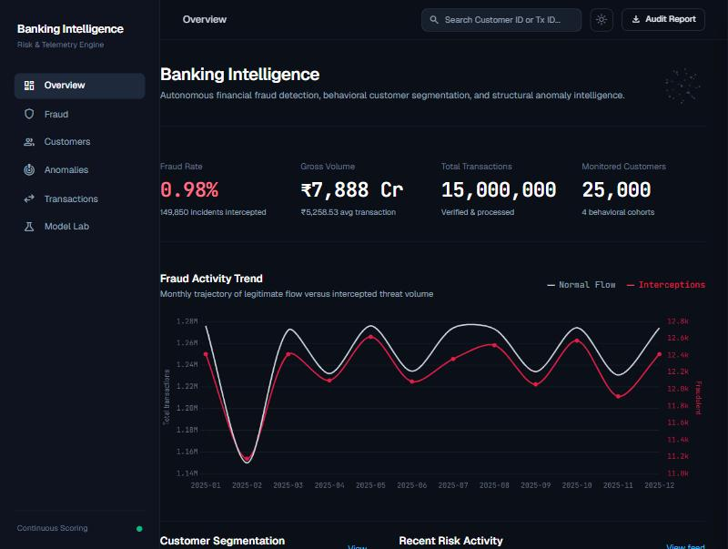
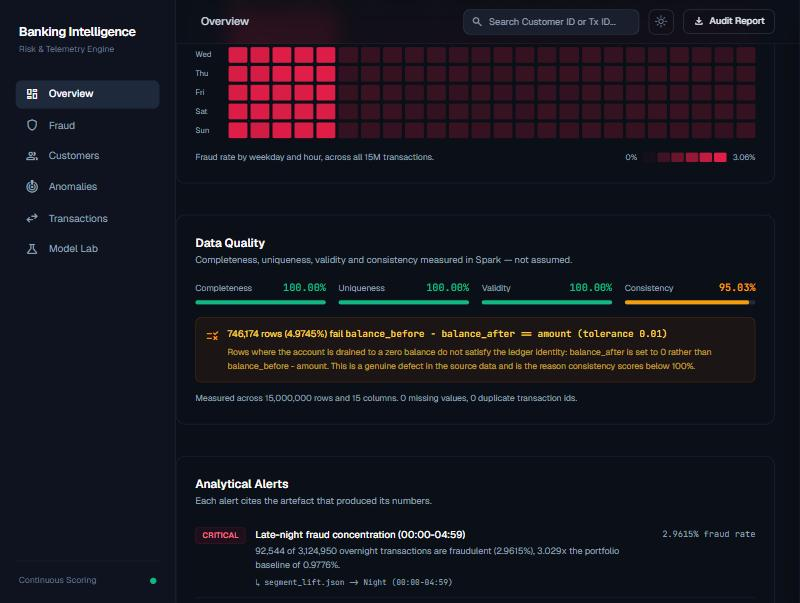
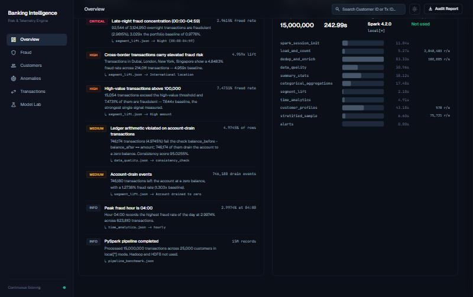
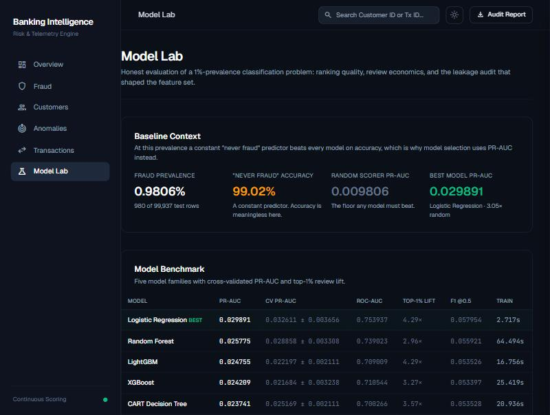

# Banking Transaction Big Data Analytics for Fraud Detection and Customer Segmentation

> **NO-HADOOP DIRECTIVE**: This project uses **Apache Spark / PySpark** in local standalone mode (`local[*]`). It **does not** use, configure, import or require Hadoop, HDFS, YARN or Java MapReduce.

[](https://github.com/Clive0707/Banking-Fraud-Analytics/actions/workflows/ci.yml)

End-to-end Big Data analytics platform over **15,000,000 banking transactions (~1.85 GB)**: a PySpark pipeline, a five-model fraud benchmark with cost-based thresholding, K-Means customer segmentation, Isolation Forest anomaly detection, a Flask API and an interactive dashboard.


*Executive overview across 15,000,000 transactions — ₹7,888 Cr volume, 0.98% fraud rate, monthly volume against fraud on independent axes.*

---

## 1. The headline finding

Most fraud-detection projects report 95%+ accuracy and stop there. On this dataset that number is meaningless, and the analysis that replaces it is the point of the project.

**Fraud prevalence is 0.98%.** A model that predicts "never fraud" therefore scores **99.02% accuracy** while catching nothing. Any accuracy below that is worse than a constant.

So the project reports what actually matters:

| Measure | Value | Reference |
|---|---|---|
| Best model (Logistic Regression) PR-AUC | **0.0299** | random scorer: 0.0098 → **3.05× better** |
| ROC-AUC | 0.754 | random: 0.500 |
| Precision reviewing the riskiest 0.1% | **8.00%** | portfolio baseline 0.98% → **8.2× lift** |
| Expected net saving at the cost-optimal threshold | **₹16.96 L** per 100k transactions | ₹300/review, 90% recovery |

The classifier's F1 is only ~0.06 — and that is reported honestly rather than hidden. The value is not in classifying; it is in **ranking**. Reviewing the top 0.1% of transactions by model score surfaces fraud at 8× the base rate, which is what makes the model deployable.

---

## 2. Target leakage: the column that had to be removed

A cross-tabulation of `transaction_status` against `is_fraud` across all 15M rows:

| transaction_status | Legitimate | Fraudulent | Fraud rate |
|---|---:|---:|---:|
| **Declined** | 0 | 977 | **100.00%** |
| **Flagged** | 0 | 2,722 | **100.00%** |
| Completed | 480,042 | 1,200 | 0.249% |
| Pending | 14,743 | 0 | 0.00% |

The rule `transaction_status ∈ {Declined, Flagged}` achieves **precision 1.000 and recall 0.755 with no model at all.**

This is textbook target leakage. `transaction_status` records *the bank's own fraud verdict*, which only exists after the fraud decision has been made. At scoring time an incoming transaction is still `Pending`, so the field cannot be used — even though it separates the training labels almost perfectly.

Training the same decision tree with and without it:

| Metric | Clean (deployed) | Leaky | Inflation |
|---|---:|---:|---:|
| PR-AUC | 0.0259 | 0.7727 | **29.9×** |
| ROC-AUC | 0.728 | 0.929 | 1.28× |
| F1 | 0.0566 | 0.4639 | **8.2×** |

The leaky model's numbers are the ones a naive benchmark would publish. They are unreachable in production. The audit lives in [`src/fraud_detection/leakage_analysis.py`](src/fraud_detection/leakage_analysis.py), runs automatically before every training run, and includes a generic scan that flags *any* categorical level that is suspiciously pure — so a future dataset change gets caught rather than silently trained on.

---

## 3. What actually predicts fraud

Measured across all 15M transactions ([`segment_lift.json`](data/processed/segment_lift.json)), against the 0.9776% baseline:

| Segment | Transactions | Fraud rate | Lift |
|---|---:|---:|---:|
| International **and** high amount | 207 | 10.63% | **10.87×** |
| Overnight **and** high amount | 3,150 | 9.21% | **9.42×** |
| High amount (> ₹100,000) | 15,054 | 7.47% | **7.64×** |
| Overnight **and** international | 44,748 | 6.87% | **7.02×** |
| International (Dubai, Singapore, New York, London) | 214,011 | 4.85% | **4.96×** |
| Overnight (00:00–04:59) | 3,124,950 | 2.96% | **3.03×** |
| Account drained to zero | 746,180 | 1.27% | 1.30× |
| No risk flag set | 11,694,048 | 0.39% | 0.40× |

These measurements *define* the engineered features — the project does not assert that night-time transactions are riskier, it measures how much riskier and builds the flag from the result. Interactions are included because `night ∧ international` (7.02×) exceeds what either flag reaches alone.

Fraud concentrates overnight and across borders, not in any particular merchant or payment channel.

---

## 4. Data quality: measured, not assumed


*The 7×24 heatmap makes the overnight concentration visible at a glance; the consistency score is amber because the pipeline found a real defect.*

The pipeline computes four quality dimensions in Spark rather than asserting them:

| Dimension | Score | Basis |
|---|---:|---|
| Completeness | 100.00% | 0 nulls across 15M × 15 cells |
| Uniqueness | 100.00% | 0 duplicate `transaction_id` |
| Validity | 100.00% | 6 rules: positive amounts, non-negative balances, binary target, parseable dates, hour ∈ [0,23] |
| **Consistency** | **95.03%** | ledger identity `balance_before − balance_after == amount` |

The consistency check found a **real defect**: **746,174 rows (4.97%)** violate ledger arithmetic, and **every single one** is an account-drain row where `balance_after` was forced to `0` instead of `balance_before − amount`. Those rows also carry a 1.30× fraud lift.

---

## 5. Architecture

```
banking-fraud-analytics/
├── src/
│   ├── config.py                      # paths, thresholds, cost model, JDK discovery
│   ├── features.py                    # single source of truth for feature engineering
│   ├── preprocessing/preprocess.py    # PySpark pipeline (local[*], no Hadoop)
│   ├── fraud_detection/
│   │   ├── train_models.py            # 5-model benchmark (500k stratified sample)
│   │   ├── spark_ml.py                # Spark MLlib benchmark (ALL 15M rows)
│   │   ├── metrics.py                 # PR-AUC, precision@k, lift, gain, cost curves
│   │   └── leakage_analysis.py        # target-leakage audit
│   ├── customer_segmentation/clustering.py
│   └── anomaly_detection/anomaly.py
├── backend/                           # Flask API (25 endpoints)
├── frontend/                          # dashboard: app.js + analytics.js (Model Lab)
├── scripts/
│   ├── generate_dataset.py            # regenerate the 15M-row source CSV
│   └── smoke_test.py                  # end-to-end pipeline verification
├── tests/                             # 113 pytest tests
└── Dockerfile / .github/workflows/ci.yml
```

**`src/features.py` matters.** Feature engineering was previously written out four separate times — in the Spark pipeline, the trainer, the anomaly detector and the Flask inference path — and the copies had drifted. A transaction could be featurised one way at training time and another at prediction time, which is the classic training/serving skew bug. Everything now routes through one `build_features`, and a test asserts that a single-row inference frame produces the exact training column set.

---

## 6. PySpark pipeline

Eleven stages over 15M rows, **242.99 seconds total** on `local[*]` with an 8 GB driver:

| Stage | Time | Throughput |
|---|---:|---:|
| Session init | 11.04s | |
| Load + count | 5.27s | 2,848,483 rows/s |
| Dedup + enrich | 83.33s | 180,005 rows/s |
| Data quality | 30.96s | |
| Summary statistics | 38.12s | |
| Categorical aggregations | 17.48s | |
| Segment lift | 2.10s | |
| Temporal analytics | 4.91s | |
| Customer profiles (window functions) | 43.18s | 25,000 customers |
| Stratified sample | 6.60s | 75,721 rows/s |
| Alerts | 0.00s | |


*Every alert cites the artefact that produced its numbers; stage timings come from the run itself.*

Techniques used: `StructType` schema enforcement, `dropDuplicates`, multi-column `groupBy`/`agg`, **Spark SQL window functions** (`lag` over `partitionBy(customer_id).orderBy(ts)`) for inter-transaction velocity, `sampleBy` for reproducible stratified sampling, Arrow-accelerated `toPandas`, and Parquet output.

Per-stage timings are written to `pipeline_benchmark.json` and rendered on the dashboard.

---

## 7. Models


*The Model Lab leads with the baseline context — a constant predictor's 99.02% accuracy — so the benchmark below is read against the right reference.*

Five families, selected on **PR-AUC** rather than accuracy or F1 at an arbitrary cut:

| Model | PR-AUC | CV PR-AUC | ROC-AUC | Top-1% lift | Train |
|---|---:|---:|---:|---:|---:|
| **Logistic Regression** | **0.0299** | 0.0326 ± 0.0037 | 0.754 | 4.29× | 2.7s |
| Random Forest | 0.0258 | 0.0289 ± 0.0033 | 0.739 | 2.96× | 64.5s |
| LightGBM | 0.0248 | 0.0222 ± 0.0021 | 0.709 | 4.29× | 16.8s |
| XGBoost | 0.0242 | 0.0217 ± 0.0032 | 0.711 | 3.27× | 25.4s |
| CART Decision Tree | 0.0237 | 0.0252 ± 0.0021 | 0.700 | 3.57× | 20.9s |

**The linear model wins**, and that is a finding rather than an accident: once the leaked status column is removed, the remaining signal is a handful of additive threshold effects (overnight, international, high-value). Gradient boosting has nothing non-linear left to exploit and adds variance instead.

Methodology:
- Every estimator is a self-contained `Pipeline`, so scaling travels inside the artefact; the serving path no longer branches on the model's name to decide whether to scale.
- Categoricals are **one-hot encoded**. `LabelEncoder` previously imposed a meaningless ordering on `location`, which made the 5× international lift invisible to the linear model.
- Per-customer baseline features are fitted **on the training split only**, so test rows do not contribute to their own baselines.
- Thresholds are tuned per model for F1 and for expected net saving.

### Distributed training on all 15M rows

The benchmark above trains on the 500,000-row stratified sample because scikit-learn is single-node. Spark MLlib trains on the **complete dataset** — feature engineering, splitting, class weighting, fitting and evaluation all distributed, with only the final metrics collected to the driver:

```bash
python run.py --spark-ml
```

| Spark model (11,998,182 training rows) | PR-AUC | ROC-AUC | Top-1% lift | Train |
|---|---:|---:|---:|---:|
| **Spark GBT** | **0.0310** | 0.755 | 5.36× | 379s |
| Spark Logistic Regression | 0.0303 | 0.754 | 5.25× | 156s |
| Spark Random Forest | 0.0290 | 0.752 | 4.99× | 653s |

Whole benchmark: **1,829 seconds** over 15M rows, tested on a held-out 3,001,818.

**Does 30× the data help?** Barely, on the summary metric:

| | Training rows | PR-AUC | Top-1% lift |
|---|---:|---:|---:|
| scikit-learn (stratified sample) | 399,747 | 0.0299 | 4.29× |
| Spark MLlib (full dataset) | 11,998,182 | 0.0310 | **5.36×** |
| | **30×** | **+3.9%** | **+25%** |

PR-AUC moves 3.9% for thirty times the training data — the sample already sits on the plateau of the learning curve, which justifies the sampling decision with a measurement instead of an assumption.

The lift at the top 1% is the more interesting number: it improves **25%**, from 4.29× to 5.36×. The extra data does not make the model better at separating the whole population, but it does sharpen the ranking at the very top — which is exactly the slice an analyst team reviews, so it is the improvement that would actually be felt in production.

---

### Threshold economics

Instead of defaulting to 0.5, the operating point maximises expected net saving under an explicit cost model (₹300 per manual review, 90% recovery on a caught fraud):

| | Threshold | Alerts | Precision | Recall | Net saving |
|---|---:|---:|---:|---:|---:|
| Default | 0.500 | 22,832 | 3.02% | 70.4% | — |
| Best F1 | 0.779 | 4,710 | 3.99% | 19.2% | — |
| **Cost-optimal** | **0.809** | **1,925** | 4.62% | 9.1% | **₹16.96 L** |

Raising the threshold cuts alerts by 92% and turns an unusable firehose into a reviewable queue.

---

## 8. Customer segmentation

K-Means over per-customer aggregates, with **K chosen from the elbow curve** rather than hardcoded. The previous version computed the curve and then set `K = 4` unconditionally.

The honest result: **this customer base barely segments.**

| Cluster | Label | Customers | Fraud rate | Separation |
|---|---|---:|---:|---|
| 1 | High Spending / VIP | 2,143 (8.6%) | 1.32% | **distinct** (5.05× population spend) |
| 2 | Domestic-Only | 5,827 (23.3%) | 0.91% | distinct |
| 3 | Cross-Border Active | 8,921 (35.7%) | 0.99% | **weak** |
| 0 | Occasional | 8,109 (32.4%) | 0.92% | **weak** |

Silhouette at K=4 is **0.131** — weak separation. Clusters 0 and 3, covering **68% of the base**, sit within 14% of each other on every feature: K-Means is splitting one behavioural population rather than finding two. The payload says so explicitly in `segmentation_quality.interpretation`. Per-customer aggregates support identifying a high-spend segment; transaction-level sequence features would be needed for finer segmentation.

Reporting this is more useful than presenting four confident-looking segments the data does not support.

---

## 9. Anomaly detection

Isolation Forest (`contamination = 0.025`) over 7 structural features, trained **without labels**. The labels are then used purely to check whether the outliers it finds mean anything:

| Measure | Value |
|---|---:|
| Outliers flagged | 12,493 (2.50% of sample) |
| Precision against `is_fraud` | 2.94% |
| Recall | 7.49% |
| **Lift vs baseline** | **3.00×** |
| ROC-AUC of the anomaly score | 0.665 |

Structural outliers are 3× richer in fraud than the portfolio — useful as an unsupervised triage signal, and measurably weaker than the supervised ranker. The original implementation reported how many outliers it found but never checked whether they corresponded to fraud at all.

---

## 10. Dashboard

Six sections served by Flask, all driven by computed artefacts.

- **Overview** — KPIs, monthly trend (dual-axis), **7×24 weekday/hour fraud heatmap**, measured data-quality scorecard, alert feed with evidence pointers, per-stage Spark benchmark.
- **Fraud** — channel vulnerability, **risk segment lift**, hourly fraud rate vs volume, **fraud rate by location** (international corridors highlighted), suspicious queue, live prediction sandbox.
- **Model Lab** — no-skill baseline callout, model leaderboard, **PR curves** with the no-skill floor, ROC curves, **cumulative gain**, precision@k, **threshold economics**, feature importance, and the **target-leakage audit**.
- **Customers** — segment cohorts and Customer 360 with velocity metrics.
- **Anomalies** — score distribution and the priority outlier queue.
- **Transactions** — filterable, paginated explorer with CSV export.

### No placeholder values

Several displayed metrics used to be invented. All are now computed or shown as unavailable:

- `fraud_probability: 0.945` was stamped on **every** suspicious transaction; probabilities now come from the model.
- The model drawer fell back to `accuracy 0.95 / precision 0.92 / recall 0.91 / AUC 0.96` — roughly **30× the real precision** — and read fields that no longer existed.
- The investigation drawer read flat fields from a nested payload, so every value was `undefined` and the risk line printed a literal `CRITICAL (0.945)`.
- Charts fell back to hardcoded series when the API failed; they now render an explicit "unavailable" state.
- Data-quality scores were hardcoded `100.0` with `missing_values_count: 0` — never computed. The real consistency score is 95.03%.
- Alerts contained hand-typed figures (`"2.41%"`, `"28,490 transactions"`) that no computation produced.

---

## 11. Installation and running

```bash
pip install -r requirements.txt
```

**The dataset is not in the repository** — at 1.76 GB it exceeds GitHub's 100 MB file limit. Regenerate it:

```bash
python scripts/generate_dataset.py
```

The dashboard and the sampled models work without it (the stratified sample and all computed artefacts are committed); only the PySpark pipeline and distributed training need the full file. See §13.

```bash
python run.py --all          # full rebuild, then serve
python run.py                # serve, reusing existing artefacts
python run.py --reprocess    # rerun the Spark pipeline only
python run.py --train        # retrain the sampled scikit-learn models only
python run.py --spark-ml     # train Spark MLlib on ALL 15M rows (needs the raw CSV)
python run.py --no-serve --all   # batch rebuild, no web server
python run.py --production   # serve via waitress instead of the dev server
```

Dashboard: **http://127.0.0.1:5000/**

Docker:

```bash
docker build -t banking-fraud-analytics .
docker run -p 5000:5000 -v "$PWD/data:/app/data" -v "$PWD/models:/app/models" banking-fraud-analytics
```

Tests:

```bash
pytest                       # 113 unit and API tests
python scripts/smoke_test.py # full pipeline on synthetic data, no raw file needed
```

---

## 12. API

| Endpoint | Returns |
|---|---|
| `GET /api/health` | Readiness, loaded models, artefact presence |
| `GET /api/summary` | Portfolio KPIs and headline model metrics |
| `GET /api/transactions` | Filterable, paginated transactions |
| `GET /api/transactions/export` | Filtered CSV export |
| `GET /api/fraud` | Categorical fraud breakdowns and the scored suspicious queue |
| `GET /api/fraud/trends` | Monthly and daily series |
| `GET /api/fraud/investigation/<id>` | Risk factors, customer context, model score |
| `GET /api/segment-lift` | Fraud lift per risk segment |
| `GET /api/leakage` | Target-leakage audit |
| `GET /api/time-analytics` | Hourly, weekday and 7×24 heatmap |
| `GET /api/geo-analytics` | Per-location fraud rates and lift |
| `GET /api/payment-device-analytics` | Channel and device breakdowns |
| `GET /api/clusters` | K-Means segments, curves, quality verdict |
| `GET /api/customer/<id>` | Customer 360 with velocity metrics |
| `GET /api/anomalies` | Isolation Forest summary and label validation |
| `GET /api/model-performance` | Full benchmark with curves and baselines |
| `GET /api/spark-ml` | Spark MLlib results on all 15M rows, vs the sampled benchmark |
| `GET /api/thresholds` | Threshold sweep and cost curves |
| `GET /api/feature-importance` | Per-model feature importance |
| `GET /api/data-quality` | Measured quality scores |
| `GET /api/processing` | Spark stage timings |
| `GET /api/alerts` | Computed alert feed |
| `GET /api/report` | Full executive report payload |
| `POST /api/predict` | Score a transaction with explained risk factors |

---

## 13. Dataset

**`banking_transactions_15m.csv`** — 15,000,000 rows, ~1.76 GB, 1 Jan – 31 Dec 2025, 25,000 customers, 12 merchants, 14 locations.

Schema: `transaction_id`, `customer_id`, `transaction_date`, `transaction_time`, `transaction_type`, `account_type`, `amount`, `balance_before`, `balance_after`, `merchant`, `location`, `payment_method`, `device_type`, `transaction_status`, `is_fraud`.

`is_fraud` is strictly the target and is never a feature. `transaction_status` is excluded from every feature set for the reason in §2.

### Getting the data

GitHub rejects files above 100 MB, so the 1.76 GB source file is **not in this repository**. Regenerate it:

```bash
python scripts/generate_dataset.py
```

That writes `data/raw/banking_transactions_15m.csv` in a few minutes and verifies it against the documented properties. Smaller runs are available for a quick check:

```bash
python scripts/generate_dataset.py --rows 1000000   # 1M rows
python scripts/generate_dataset.py --verify-only    # check an existing file
```

**What works without it.** The stratified sample and every computed artefact *are* committed, so a fresh clone can already run the dashboard, retrain the scikit-learn models and run the segmentation. The dataset is only needed for `--reprocess` (the PySpark pipeline) and `--spark-ml` (distributed training).

| From a fresh clone | Needs the raw CSV? |
|---|---|
| `python run.py` — dashboard | No |
| `python run.py --train` — retrain sampled models | No |
| `python run.py --segment` / `--anomalies` | No |
| `python run.py --reprocess` — PySpark pipeline | **Yes** |
| `python run.py --spark-ml` — distributed training | **Yes** |

### Fidelity of the regenerated data

Every generator parameter was measured from the original file, not invented: the categorical mixes, the clipped-lognormal amounts (median ₹1,946, mean ₹5,267), the balance distribution, and a fraud probability table keyed by (overnight, international, high-value) that reproduces the measured lifts and their interactions.

Two mechanics are reproduced exactly because the analysis depends on them:

- **The ledger defect.** A transaction larger than the available balance zeroes it rather than overdrawing, which is what drops the consistency score to ~95%. A balance reaches zero exactly when the amount meets or exceeds it; spending it to the rupee also lands on zero, but by ordinary subtraction, so that case is a drain without being a ledger violation.
- **The target leak.** `Declined` and `Flagged` occur only on fraudulent rows, so the leakage audit in §2 has something to find.

This reproduces the dataset's *statistical structure*, not its exact bytes. A fresh draw lands near the headline figures rather than on them — the 0.9776% fraud rate, 746,174 ledger violations and 95.03% consistency quoted above were measured on the original file. The generator's `--verify` step checks each property against an explicit tolerance band and fails loudly if one drifts:

```
[PASS] fraud rate near 1% -- 1.0104%
[PASS] overnight lift ~3x -- 3.02x
[PASS] international lift ~5x -- 4.87x
[PASS] high-value lift >5x -- 8.45x
[PASS] status leak present (precision 1.0)
[PASS] ledger defect ~5% -- 4.281%
[PASS] drains correspond exactly to overdrafts
```

**Sampling.** PySpark processes all 15M records for cleaning, aggregation and metrics. For scikit-learn training it draws a reproducible **stratified sample of ~500,000 records** (`sampleBy`, seed 42) that preserves the `is_fraud` class distribution exactly, so single-node model training fits in local RAM without discarding fraud cases. Spark MLlib trains on the full 15M in parallel — see §7.

---

## 14. Technology

**Big data** PySpark 4.2 (`local[*]`, no Hadoop/HDFS/YARN), PyArrow, Parquet
**ML** Spark MLlib (distributed, all 15M rows), Scikit-learn, XGBoost, LightGBM, Joblib
**Backend** Python 3.10+, Flask, Waitress
**Frontend** HTML5, Tailwind, ES6, Chart.js 4
**Quality** pytest (113 tests), GitHub Actions, Docker, Ruff
